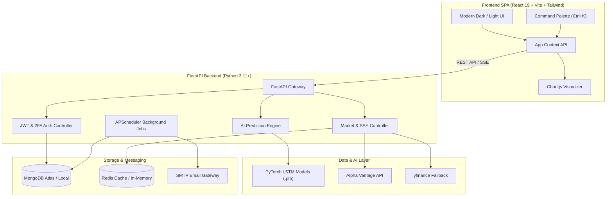

# StockSense 📈

> **Next-Generation Real-Time Stock Market Intelligence, Portfolio Analytics & Deep Learning LSTM Price Forecasting Platform.**

[](https://stock-market-tan-delta.vercel.app/)
[](http://127.0.0.1:8000/docs)
[](https://www.python.org/)
[](https://react.dev/)
[](https://fastapi.tiangolo.com/)
[](https://www.mongodb.com/)
[](LICENSE)

---

## 📸 Preview

[](https://stock-market-tan-delta.vercel.app/)

> 🚀 **Click the preview image above or visit [https://stock-market-tan-delta.vercel.app/](https://stock-market-tan-delta.vercel.app/) to launch the live application.**

---

## 🌐 Live Deployment & Demo

| Service | Environment | URL |
| :--- | :--- | :--- |
| **Frontend Web App** | Production (Vercel) | [https://stock-market-tan-delta.vercel.app/](https://stock-market-tan-delta.vercel.app/) |
| **Backend API** | Production / Local | [http://127.0.0.1:8000](http://127.0.0.1:8000) |
| **Interactive API Docs** | Swagger UI | [http://127.0.0.1:8000/docs](http://127.0.0.1:8000/docs) |
| **API Health Check** | System Monitor | [http://127.0.0.1:8000/api/health](http://127.0.0.1:8000/api/health) |

> 💡 **Live Demo Quick Access**: Visitors can register a free account with email verification (OTP), explore live market quotes, test interactive technical charts, track real-time portfolios, and inspect PyTorch LSTM neural network price forecasts.

---

## 🚀 Key Features

### 1. 📊 Real-Time Market Intelligence
- **Live Price Streaming**: Real-time ticker price feeds delivered via **Server-Sent Events (SSE)** at `/stream/prices` with graceful automated fallback to high-frequency polling.
- **Global Market Indicators**: Instant tracking of major benchmark indices (S&P 500, NASDAQ, Dow Jones) and active market breadth.
- **Hybrid Data Pipeline**: Primary high-throughput data extraction via **Alpha Vantage**, backed by resilient automatic failover to **yfinance**.

### 2. 🤖 Deep Learning LSTM Price Predictions
- **Multi-Layer LSTM Networks**: Custom PyTorch recurrent neural network architecture (`StockLSTM`) trained on multi-year technical indicators.
- **17 Pre-Trained Stock Models**: Turnkey support for market leaders (AAPL, ADBE, AMD, AMZN, BA, CRM, DIS, GOOGL, INTC, JNJ, JPM, META, MSFT, NFLX, NVDA, PYPL, TSLA, V, WMT).
- **Advanced Feature Engineering**: Normalized OHLCV sequences coupled with RSI (14-period), Bollinger Bands, MACD, Moving Averages (7/21/50-day), and rolling 20-day volatility.
- **Uncertainty Quantification**: Monte Carlo (MC) Dropout inference producing confidence bands and automated trading signals (*Strong Buy*, *Buy*, *Hold*, *Sell*).
- **Graceful Fallback**: Statistical time-series heuristics ensure zero app downtime even on lightweight hosts without GPU/PyTorch.

### 3. 💼 Portfolio & Watchlist Management
- **Position & Holdings Tracker**: Live calculation of total asset valuation, daily change, realized and unrealized P&L.
- **Risk & Allocation Visualizer**: Portfolio weight distributions and transaction logs with instant **CSV export** (`/api/portfolio/export.csv`).
- **Interactive Watchlists**: One-click symbol addition, inline sparklines, and custom notifications.

### 4. 🔔 Automated Alert Engine & Digests
- **Threshold Price Triggers**: Dynamic price alerts (above/below target price) evaluated during active market trading hours.
- **Automated APScheduler**: Background cron workers for periodic alert sweeps and daily/weekly email digests.
- **Transactional SMTP Emails**: Branded Jinja2 HTML email templates for OTP verification, welcome onboarding, reset tokens, and instant threshold notifications.

### 5. 🛡️ Enterprise-Grade Security
- **Asynchronous MongoDB Backend**: Clean domain separation utilizing Motor for high-concurrency non-blocking database queries.
- **JWT Authentication & Bcrypt**: Secure token-based session management with rotating refresh schemes.
- **Two-Factor Authentication (TOTP)**: RFC 6238 compliant 2FA via Google Authenticator / Authy (`pyotp`).
- **Security Audit Logs**: Comprehensive event recording (`audit_events`) for authentication attempts, password resets, and critical account actions.

---

## 🏗️ System Architecture



---

## 📁 Project Structure

```text
Stock-Market/
├── assets/          # Dashboard preview images & media
├── client/          # Frontend React 19 + Vite + Tailwind dashboard
├── server/          # Backend FastAPI REST & SSE services
├── .gitignore       # Git ignore configuration
└── README.md        # Project documentation
```

---

## 🛠️ Tech Stack

| Layer | Technologies |
| :--- | :--- |
| **Frontend** | React 19, Vite 8, Tailwind CSS, React Router 7, Chart.js 4, Lucide Icons |
| **Backend** | FastAPI, Uvicorn, Motor (Async MongoDB), Pydantic v2, SSE-Starlette |
| **Machine Learning** | PyTorch (LSTM), scikit-learn, NumPy, Pandas |
| **Market Data** | Alpha Vantage API, yfinance API |
| **Database & Cache** | MongoDB (Atlas / v7+), Redis (with in-memory fallback) |
| **Auth & Security** | JWT (`python-jose`), bcrypt, TOTP 2FA (`pyotp`), SlowAPI |
| **Task Scheduling** | APScheduler (Automated price checks & market digests) |
| **Email Service** | SMTP + Jinja2 HTML templates |
| **Deployment** | Vercel (Frontend), Render / Railway / Docker (Backend) |

---

## ⚡ Quickstart (Local Development)

### Prerequisites
- **Python 3.11+** installed
- **Node.js 18+** & npm installed
- **MongoDB** instance running locally (`mongodb://localhost:27017`) or a free [MongoDB Atlas](https://www.mongodb.com/cloud/atlas) cluster URI

---

### Step 1: Backend Setup

```bash
# 1. Navigate to the server folder
cd server

# 2. (Recommended) Create and activate a virtual environment
python -m venv .venv
# On Windows:
.venv\Scripts\activate
# On macOS/Linux:
source .venv/bin/activate

# 3. Install dependencies
pip install -r requirements.txt

# 4. Configure environment variables
cp .env.example .env
# Edit .env with your MONGO_URI and API keys (see table below)

# 5. Start the backend server
python main.py
```

* Backend server will start on **`http://127.0.0.1:8000`**
* Interactive API Documentation (Swagger UI): **`http://127.0.0.1:8000/docs`**
* Alternative API Documentation (ReDoc): **`http://127.0.0.1:8000/redoc`**

---

### Step 2: Frontend Setup

Open a new terminal window:

```bash
# 1. Navigate to the client folder
cd client

# 2. Install dependencies
npm install

# 3. Configure environment (optional in local dev)
cp .env.example .env

# 4. Start the Vite development server
npm run dev
```

* Frontend application will start on **`http://localhost:5173`**
* The Vite dev server automatically proxies `/api`, `/auth`, and `/stream` to `http://127.0.0.1:8000`.

---

## 🔑 Core Environment Variables

| Variable | Location | Description | Example / Default | Required |
| :--- | :--- | :--- | :--- | :---: |
| `MONGO_URI` | server/.env | MongoDB connection URI | mongodb://localhost:27017 | Yes |
| `JWT_SECRET` | server/.env | Secret key for JWT signing | your-secret-key-here | Yes |
| `FRONTEND_ORIGIN` | server/.env | Allowed CORS frontend origins | http://localhost:5173 | Yes |
| `VITE_API_BASE_URL` | client/.env | Backend API URL (leave blank for dev proxy) | http://127.0.0.1:8000 | No |

> ℹ️ *Optional variables (such as `ALPHA_VANTAGE_KEY` and SMTP settings) can be configured in `server/.env.example`.*

---

## 📡 API Endpoints Overview

| Group | Method | Endpoint | Description | Auth |
| :--- | :--- | :--- | :--- | :---: |
| **System** | `GET` | `/api/health` | Healthcheck (DB status & scheduler) | None |
| **System** | `GET` | `/stream/prices` | SSE live market prices stream | None |
| **Market** | `GET` | `/get_live_data` | Batch live prices & indicators | None |
| **Market** | `GET` | `/api/market/quote/{symbol}` | Real-time quote for single stock | None |
| **Market** | `GET` | `/api/market/history/{symbol}` | OHLCV historical time-series data | None |
| **AI** | `GET` | `/api/predict/{symbol}` | LSTM multi-horizon prediction & signals | None |
| **AI** | `POST` | `/api/ai/train/{symbol}` | Trigger LSTM model retraining | Bearer |
| **Auth** | `POST` | `/auth/register` | User sign-up & OTP dispatch | None |
| **Auth** | `POST` | `/auth/verify-otp` | Verify 6-digit OTP & generate JWT | None |
| **Auth** | `POST` | `/auth/login` | Email/password login | None |
| **Auth** | `POST` | `/auth/forgot-password` | Request password reset token | None |
| **Auth** | `POST` | `/auth/reset-password` | Set new password with token | None |
| **Auth** | `POST` | `/auth/2fa/setup` | Generate TOTP QR seed | Bearer |
| **Auth** | `POST` | `/auth/2fa/verify` | Verify & enable 2FA | Bearer |
| **Watchlist** | `GET` | `/api/watchlist` | Get user's saved tickers | Bearer |
| **Watchlist** | `POST` | `/api/watchlist` | Add stock ticker to watchlist | Bearer |
| **Watchlist** | `DELETE`| `/api/watchlist/{symbol}` | Remove stock ticker from watchlist | Bearer |
| **Portfolio** | `GET` | `/api/portfolio` | Retrieve holdings, P&L, and metrics | Bearer |
| **Portfolio** | `POST` | `/api/portfolio/buy` | Record stock purchase | Bearer |
| **Portfolio** | `POST` | `/api/portfolio/sell` | Record stock sale | Bearer |
| **Portfolio** | `GET` | `/api/portfolio/export.csv`| Export portfolio report to CSV | Bearer |
| **Alerts** | `GET` | `/api/alerts` | Get configured price alerts | Bearer |
| **Alerts** | `POST` | `/api/alerts` | Create new target price alert | Bearer |
| **Alerts** | `DELETE`| `/api/alerts/{id}` | Delete price alert | Bearer |
| **Admin** | `GET` | `/api/admin/metrics` | System audit statistics & user counts | Admin |

---

## 🧪 Testing & Verification

The project includes smoke tests and linting suites for automated verification:

```bash
# Run backend smoke and integration test suite
cd server
python -m pytest tests/e2e_smoke.py -v

# Run frontend linting
cd ../client
npm run lint
```

---

## 📄 License

This project is licensed under the MIT License — see the [LICENSE](LICENSE) file for details.
