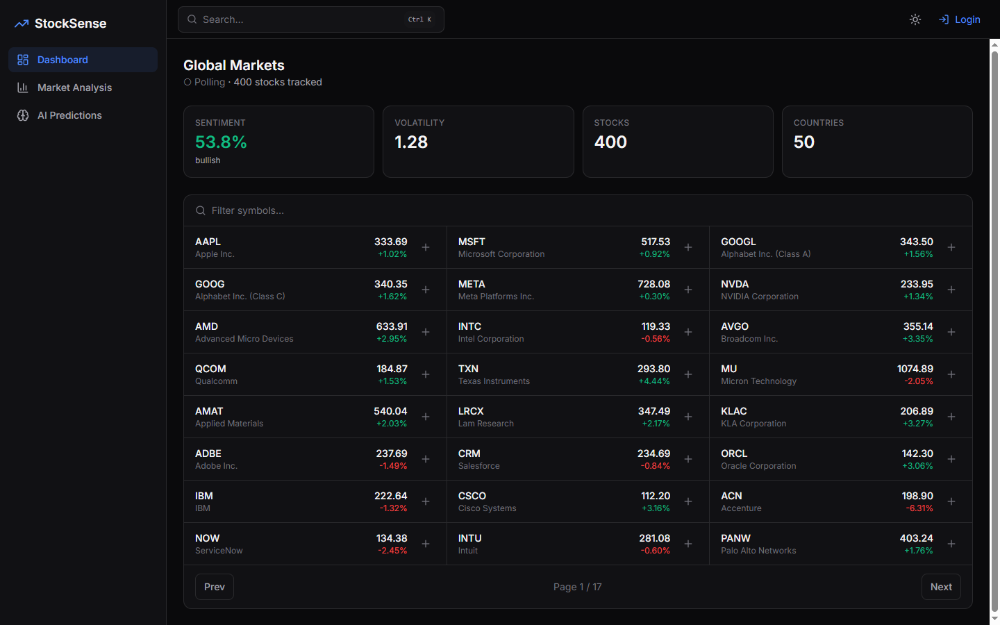

# StockSense Frontend 💻

> **Modern, High-Performance React 19 Single Page Application for Real-Time Stock Analytics & AI Forecasting.**

[](https://stocksense-dashboard.vercel.app)
[](https://react.dev/)
[](https://vitejs.dev/)
[](https://tailwindcss.com/)

---

## 📸 Preview



---

## 🌟 Architecture & Features

The client is built with **React 19** and bundled with **Vite 8**, featuring an institutional-grade dark/light financial dashboard aesthetic.

- **Global Context Architecture (`src/context/context.jsx`)**: Centralized state management for authentication, JWT storage, theme state, real-time toast alerts, and all API interactions.
- **Server-Sent Events (SSE) Live Feed**: Subscribes directly to backend market streaming events (`/stream/prices`) with automated polling fallback.
- **Interactive Financial Visualizations**: Powered by **Chart.js 4** and `react-chartjs-2`, offering multi-timeframe candlestick and line charts with technical indicators (MA, RSI, Bollinger Bands, MACD).
- **Command Palette (`src/components/CommandPalette.jsx`)**: Global `Ctrl + K` quick switcher for ticker fuzzy search and instant page navigation.
- **Responsive Layout**: Designed for all screen sizes from mobile devices to ultra-wide displays with off-canvas sidebar drawers and touch optimizations.

---

## 📁 Frontend Directory Layout

```text
client/
├── public/                 # Static assets & dashboard preview
└── src/
    ├── components/         # Reusable UI components (Chart, Sidebar, KPIs)
    ├── context/            # Global React Context (Auth, Market Data, Toasts)
    └── pages/              # Application pages (Dashboard, Market Analysis, AI Predictions)
```

---

## 🚀 Getting Started

### 1. Installation

```bash
npm install
```

### 2. Environment Configuration

Copy the example environment file:

```bash
cp .env.example .env
```

| Variable | Description | Default |
| :--- | :--- | :--- |
| `VITE_API_BASE_URL` | Base URL of deployed FastAPI backend | Blank (uses Vite reverse proxy to `127.0.0.1:8000`) |

### 3. Local Development

```bash
npm run dev
```

The application will be accessible at **`http://localhost:5173`**.

### 4. Production Build & Preview

```bash
# Build optimized static distribution
npm run build

# Preview production build locally
npm run preview
```

---

## 🌐 Production Deployment (Vercel)

The repository includes `vercel.json` configured for Single Page Application client-side routing.
When deploying on Vercel:
- **Framework Preset**: Vite
- **Root Directory**: `client`
- **Build Command**: `npm run build`
- **Output Directory**: `dist`
- **Environment Variables**:
  - `VITE_API_BASE_URL`: `https://your-backend-api.onrender.com`
